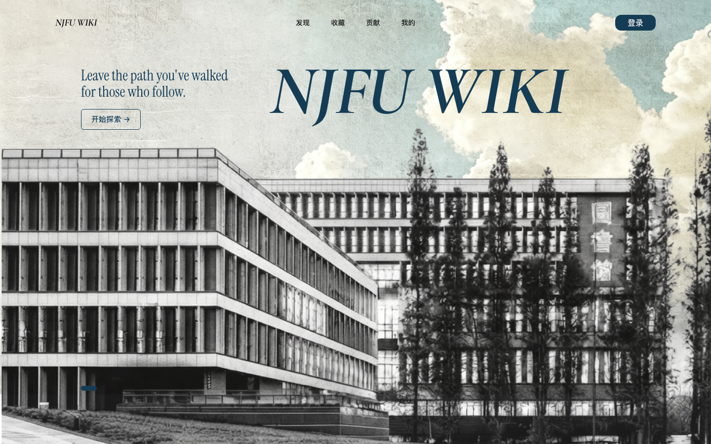
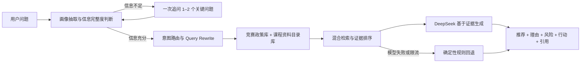

# NJFU Wiki｜校园成长与资料推荐平台

> 帮助南京林业大学学生，从“不知道该找什么”走到“知道下一步做什么”。

[在线体验](https://njfu-wiki.vercel.app) · [产品思考与方案设计](https://www.figma.com/board/Uaa8TfAvCXnz7MMvOqjiK3/NJFU-WIKI-2.0?node-id=0-1&t=TWZbfCstcUmpN2bn-1) · [用户侧 MVP PRD](./docs/product/PRD-v0.2-user-mvp.md)



## 1. 这是什么项目

NJFU Wiki 2.0 是我独立发起并完成的校园知识发现与个人发展导学平台，面向南京林业大学学生。

原 NJFU-WIKI（https://github.com/NJFU-CS/NJFU-WIKI） 以 GitHub / Docsify 静态站点承载资料，主要依赖用户沿目录查找。它解决了“资料放在哪里”，但难以继续回答“我现在需要什么”“这份内容是否适合我”“接下来先做哪一步”。课程资料和同校经验即使已经存在，用户仍可能因不了解关键词、政策口径与准备路径而无法做出选择。

2.0 因此不只是重新设计一个资料站，而是验证一条 AI Native 的决策链路：**意图澄清 → 可信判断 → 行动建议**。前期通过目录式 Wiki Audit、用户原生痛点、关键 User Flow / Friction 梳理，将问题收敛为五类：模糊意图、可信判断、行动承接、长尾求助和内容持续性；再用价值 × 难度矩阵确定首版边界，输出信息架构、PRD 与 Figma 高保真原型。

典型问题是：

> “我大三，想提高保研竞争力，会一点 Python，但不知道应该参加什么竞赛。”

目前平台提供两条互补路径：

- 明确需求：搜索课程、竞赛与学习资料，查看用途、适用阶段和原始来源。
- 模糊需求：向 Agent 描述处境，由系统澄清年级、目标、基础、时间和组队情况，再给出有依据的选择、资料和下一步行动。

### 为什么引入 Agent

传统搜索要求用户先知道关键词，但本项目最核心的用户恰恰“不知道自己需要什么”。Agent 位于知识库与界面之间，负责把模糊描述转化为可检索、可判断、可执行的任务，而不是替代知识库生成事实。

工作流为：**画像抽取 → 信息完整度判断 → 确定性追问 → 意图路由 / Query Rewrite → 双知识库检索 → 证据排序 → 结构化生成 → 引用与反馈**。

两类知识分别承担不同职责：

- 竞赛与政策库：包含竞赛类型、准备要求、时间投入、综测与推免历史口径，用于判断“什么更适合”。
- 课程资料目录库：将 [NJFU-CS/NJFU-Courses](https://github.com/NJFU-CS/NJFU-Courses) 中 610 个原始文件清洗、去重并归并为 365 条可推荐资料，补充课程、资料类型、适用需求、使用阶段和来源链接，用于回答“下一步具体看什么”。

系统将上下文区分为“用户明确表达的事实”“知识库提供的平台信息”和“Agent 推断”，避免把推断写成用户事实。信息不足时只追问影响决策的关键字段；证据不足、模型失败或触发限流时降级为确定性规则结果；政策可能变化时明确提示以当届官方文件为准。

### 目前覆盖的场景

- 按课程或主题搜索资料，并打开 GitHub 原始文件。
- 根据年级、目标、基础与时间推荐竞赛和准备资料。
- 输出推荐理由、风险、准备周期和近期行动。
- 保存对话与收藏；通过贡献页模拟资料和经验投稿。

首版覆盖首页、发现、收藏、贡献、我的 5 个一级页面。在 32 名种子用户的阶段性可用性测试中，核心任务完成率提升至 88%，信息架构满意度达到 4.5/5，为 MVP 范围与验收标准提供依据。

> 本项目是个人完成的产品与工程项目，不代表南京林业大学或相关学生组织的官方服务。

## 2. 如何开始使用

### 在线体验

[打开 NJFU Wiki 在线体验](https://njfu-wiki.vercel.app)。**体验者无需填写 API Key**；模型密钥只保存在 Vercel 的服务端环境变量中，不会发送到浏览器。

推荐从下面两个任务开始：

1. 在“发现”页搜索“数据结构”，查看资料用途与原始来源。
2. 进入“AI 导学”，描述自己的年级、目标和大致基础；补充 1–2 个关键条件后，查看个性化推荐、知识依据与行动步骤。

### 本地运行

环境要求：Node.js 22.13+、pnpm。

```bash
pnpm install
cp .env.example .env.local
pnpm dev
```

仅本地开发者需要在 `.env.local` 中配置自己的模型密钥：

```env
LLM_API_BASE_URL=https://api.deepseek.com
LLM_API_KEY=你的服务端密钥
LLM_MODEL=DeepSeek 控制台当前可用的模型 ID
```

未配置模型时，界面、用户信息理解和双库检索仍可通过确定性规则基线运行。

常用检查命令：

```bash
pnpm build
pnpm lint
pnpm eval:baseline
pnpm eval:badcases
```

## 3. 它是怎样实现与验证的



### 核心实现

- 产品定义：完成旧版 Wiki Audit、用户问题与关键流程梳理、价值 × 难度优先级、产品体系、信息架构、PRD 和 Figma 高保真原型，并明确 MVP 验收范围。
- 知识工程：将 610 个原始课程文件整理为 365 条可推荐资料，构建 98 个竞赛 / 政策检索块；资料链接仅指向 NJFU-CS/NJFU-Courses，推荐结论保留来源引用。
- Agent 与 RAG：实现结构化用户画像、完成条件、确定性追问、Query Rewrite、双库混合检索、规则重排、证据约束生成与不足证据降级。
- Web 工程：使用 Next.js 16、React 19、TypeScript；完成 DeepSeek 服务端调用、超时与空响应处理、重试、频率限制、规则回退和 Vercel 私密环境变量部署。
- 体验闭环：实现对话与收藏的浏览器端状态保持；贡献、登录和用户资料作为 MVP 模拟能力，用于验证完整信息架构与关键任务。

### 评测与迭代

项目没有只验证“页面能不能运行”，而是从用户理解、知识检索、生成质量、推荐决策与实际可用性五个维度建立评测规则和 Bad Case 回归集，并依据归因结果迭代 Prompt、检索参数、追问逻辑和推荐规则。

| 层级 | 迭代结果 | 评测作用 |
| --- | ---: | --- |
| 用户理解 | 画像字段准确率 86.3% → 97%；不必要追问率 30% → 10% | 回归信息遗漏、重复追问与错误继承 |
| 知识检索 | Recall@5 65.6% → 73.1%；MRR@5 0.831 → 0.919；Hit@5 93.3% → 100% | 判断相关证据能否被召回并排在前列 |
| 生成与推荐 | 忠实度 89.5%；答案相关性 100%；推荐适配度 90.0%；行动可执行性 94.7% | 检查答案是否基于证据、真正回答问题并产生下一步行动 |
| 用户体验（32 人） | 追问满意度 3.8 → 4.6/5；资料点击采纳率 54% → 78%；整体 CSAT 4.6/5；NPS +42 | 验证系统是否“问得准、给得可信、用户愿意采用” |

其中，自动评测与人工评审覆盖 30 个检索任务和 19 个生成样本；产品体验数据来自 32 名种子用户的测试与问卷。阶段性可用性测试的核心任务完成率从 62% 提升至 88%，最终问卷口径为 87.5%；两者统计轮次不同。以上结果用于 MVP 回归与方向验证，不代表对所有真实问题的泛化表现。

我在本项目中完成了：

- 从需求洞察、优先级判断、信息架构与 PRD 到 Figma 原型，独立定义并收敛 MVP。
- 从原始资料清洗、知识库结构、切分与元数据设计，到 Agent 工作流、Prompt、检索与推荐规则，完成核心 AI 产品方案。
- 完成前后端实现、DeepSeek 接入、服务端密钥隔离、异常回退、公开体验限流、GitHub 管理与 Vercel 部署。
- 建立指标、测试集、Bad Case 分类归因和自动回归流程，形成“发现问题 → 修改策略 → 量化复测”的迭代闭环。

进一步查看：[RAG 架构](./docs/rag-v1-architecture.md) · [检索评测](./evals/results/baseline-v7.md) · [生成评审](./evals/results/judge-deepseek-reasoner-v3-final.md) · [Bad Case 总表](./evals/badcases.jsonl)

### MVP 边界

当前版本用于验证“模糊意图澄清 → 双库检索 → 个性化推荐 → 行动承接”的核心链路。登录身份、贡献审核、多人数据与运营后台尚未接入正式数据库；竞赛、综测和推免信息可能随年份变化，实际决策应以当届学校及学院文件为准。
