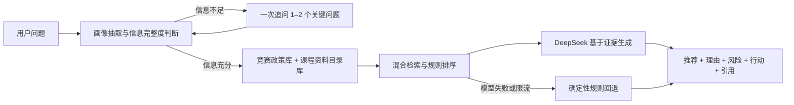

# NJFU Wiki｜校园成长与资料推荐平台

> 帮助南京林业大学计算机学院学生，从“不知道该找什么”走到“知道下一步做什么”。

[在线体验](https://njfu-wiki.vercel.app) · [产品思考与方案设计](https://www.figma.com/board/Uaa8TfAvCXnz7MMvOqjiK3/NJFU-WIKI-2.0?node-id=0-1&t=TWZbfCstcUmpN2bn-1) · [用户侧 MVP PRD](./docs/product/PRD-v0.2-user-mvp.md)


## 1. 这是什么项目

NJFU Wiki 是一个面向南林计算机学生的校园知识发现与个人发展导学 MVP。

现有课程资料和同校经验已经散落在 GitHub、文档与群聊中，但“资料存在”不等于“学生知道该找什么、是否适合自己、接下来做什么”。尤其在竞赛、保研、课程学习和方向选择等场景中，用户往往只能描述一个模糊目标，例如：

> “我大三，想提高保研竞争力，会一点 Python，但不知道应该参加什么竞赛。”

项目因此提供两条互补路径：

- **明确需求：**搜索课程、竞赛与学习资料，查看用途、适用阶段和原始来源。
- **模糊需求：**向 Agent 描述处境，由系统澄清年级、目标、基础、时间和组队情况，再给出有依据的选择、资料和下一步行动。

### 为什么引入 Agent

传统搜索要求用户先知道关键词，但本项目最核心的用户恰恰“不知道自己需要什么”。Agent 位于知识库之上，负责理解用户画像、判断信息是否充分、检索并组合两类证据：

- **竞赛与政策库：**包含竞赛类型、准备要求、时间投入、综测与推免历史口径，用于判断“什么更适合”。
- **课程资料目录库：**由 [NJFU-CS/NJFU-Courses](https://github.com/NJFU-CS/NJFU-Courses) 整理出的 365 条资料元数据和原始链接，用于回答“下一步具体看什么”。

Agent 不是事实来源。事实必须来自知识库证据；信息不足时继续追问；政策可能变化时明确提醒用户以当届官方文件为准。

### 目前覆盖的场景

- 按课程或主题搜索资料，并打开 GitHub 原始文件。
- 根据年级、目标、基础与时间推荐竞赛和准备资料。
- 输出推荐理由、风险、准备周期和近期行动。
- 保存对话与收藏；通过贡献页模拟资料和经验投稿。

> 本项目是个人完成的产品与工程 MVP，不代表南京林业大学或相关学生组织的官方服务。

## 2. 如何开始使用

### 在线体验

[打开 NJFU Wiki 在线体验](https://njfu-wiki.vercel.app)。**体验者无需填写 API Key**；模型密钥只保存在 Vercel 的服务端环境变量中，不会发送到浏览器。

推荐从下面两个任务开始：

1. 在“发现”页搜索“数据结构”，查看资料用途与原始来源。
2. 进入“AI 导学”，描述自己的年级、目标和大致基础；补充 1–2 个关键条件后，查看个性化推荐、知识依据与行动步骤。

### 本地运行

环境要求：Node.js 22.13+、pnpm。

```bash
pnpm install
cp .env.example .env.local
pnpm dev
```

仅本地开发者需要在 `.env.local` 中配置自己的模型密钥：

```env
LLM_API_BASE_URL=https://api.deepseek.com
LLM_API_KEY=你的服务端密钥
LLM_MODEL=DeepSeek 控制台当前可用的模型 ID
```

未配置模型时，界面、用户信息理解和双库检索仍可通过确定性规则基线运行。

常用检查命令：

```bash
pnpm build
pnpm lint
pnpm eval:baseline
pnpm eval:badcases
```

## 3. 它是怎样实现与验证的



### 核心实现

- Next.js 16、React 19、TypeScript。
- 98 个竞赛政策检索块与 365 条课程资料目录，限制资料链接只指向 NJFU-CS/NJFU-Courses。
- 结构化用户画像、多轮信息补全、双库检索、规则重排和基于证据的生成。
- DeepSeek 服务端调用、超时与空响应处理、重试、频率限制和规则回退。
- 对话与收藏的浏览器端状态保持；贡献、登录和用户资料为 MVP 模拟能力。

### 评测与迭代

项目没有只验证“页面能不能运行”，而是分别评测用户理解、检索和生成推荐，并建立 Bad Case 回归集。

| 层级 | 当前 MVP 结果 | 主要观察 |
| --- | ---: | --- |
| 用户理解 | 字段准确率 100%，不必要追问率 0% | 用于回归“重复追问”等问题 |
| 检索 | Recall@5 73.06%，MRR@5 0.9194，nDCG@5 79.38% | 仍需扩大真实查询与难例覆盖 |
| 生成 | 忠实度 89.47%，答案相关性 100%，行动性 94.74% | 证据不足与政策时效性是重点风险 |

以上结果来自 30 个检索任务和 19 个生成评审样本，只用于 MVP 回归与问题定位，不代表对所有真实问题的泛化表现。

我在本项目中完成了：

- 从用户问题、信息架构和关键场景出发定义 MVP，并使用 Figma Make 完成交互原型。
- 整理知识库边界、资料目录、切分与引用方式，设计 Agent 的追问和推荐逻辑。
- 完成前后端实现、模型接入、服务端密钥隔离、异常回退与公开体验限流。
- 建立检索指标、生成评审、Bad Case 分类、归因和自动回归流程。

进一步查看：[RAG 架构](./docs/rag-v1-architecture.md) · [检索评测](./evals/results/baseline-v7.md) · [生成评审](./evals/results/judge-deepseek-reasoner-v3-final.md) · [Bad Case 总表](./evals/badcases.jsonl)

### MVP 边界

当前版本用于验证“模糊意图澄清 → 双库检索 → 个性化推荐 → 行动承接”的核心链路。登录身份、贡献审核、多人数据与运营后台尚未接入正式数据库；竞赛、综测和推免信息可能随年份变化，实际决策应以当届学校及学院文件为准。
